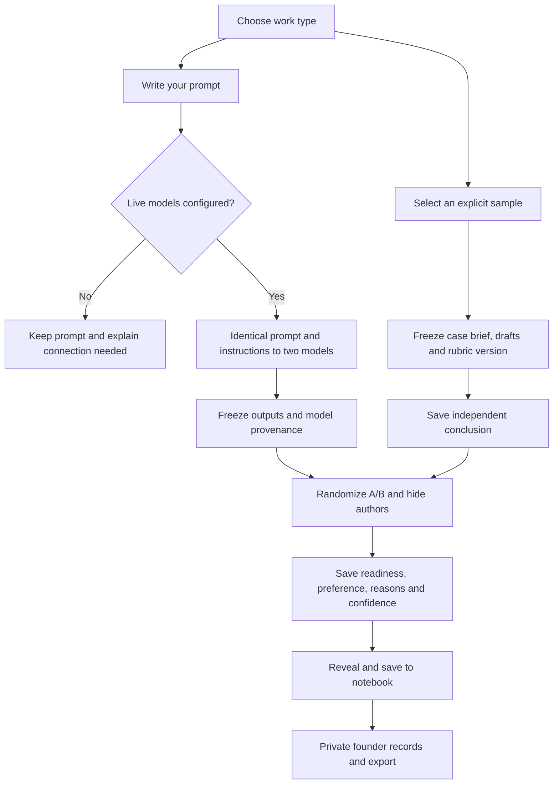

# From prompt to judgment

Implemented locally, 6 September 2026. Calibrated is the brand and Accounting is the current workspace. This is a text comparison product; it does not run a ledger, open files or operate accounting software.

## One composer, explicit sources

| Entry | What produces the two drafts | What the accountant sees |
|---|---|---|
| Own prompt + work type | Two configured OpenRouter models receive the exact same user prompt, common accounting instructions, type-specific instructions and generation settings | Anonymous A/B drafts; model names revealed after judgment |
| Explicit sample | A selected case ID loads a versioned brief, two authored drafts and a stated-policy answer key | Independent conclusion first, then anonymous drafts; authorship and checks revealed after judgment |
| Own prompt without live configuration | Nothing is generated; no run is created | Configuration message; typed prompt remains available |

There is no classifier mapping arbitrary questions to the five sample answers. The previous offline Ask walkthrough returned generic drafts unrelated to the submitted question. That fallback has been removed. Existing historical walkthrough sessions retain their original provenance.

Selecting a sample fills the composer with its exact brief. Editing the brief or changing work type clears the sample selection and requests a fresh live comparison. The server also rejects a changed brief submitted with a sample ID. A failed live generation is recorded as failed; it never becomes an authored sample.

## Work type versus sample

A type describes the requested output, like the design categories in the supplied reference. It changes the instruction supplied to both models and which sample suggestions appear. A sample is one concrete exercise within that type.

- **Journal entry:** accounts, debits/credits, amounts, timing and a supporting memo. Three current samples: insurance cutoff, subscription revenue and asset freight.
- **Treatment memo:** issue, facts, assumptions, analysis, conclusion and unresolved questions. Live prompting is wired; there is no authored sample for this type yet.
- **Workpaper review:** evaluate the supplied work, identify corrections and assess readiness. Two current samples: utilities accrual and prepaid software, both comparing documentation around supported entries.

Current samples use explicit synthetic policies. Three contrast a supported entry with a planted error; two contain supported entries with different documentation. They still need independent accountant validation. None was produced by a model.

## What is stored

The local server uses SQLite through SQLAlchemy. These records are separate from the legacy tournament/seed tables.

| Record | Contents and purpose |
|---|---|
| `pilot_participants` | Browser identity, optional self-reported background, invitation source, dataset label and separate contact/research permissions. The server stores a hash of the bearer token. |
| `pilot_runs` | Exact question or frozen case, selected type, source/version, frozen drafts, actual A/B order, provider configuration/provenance where applicable, independent conclusion, readiness of each draft, preference, reason tags, confidence, optional rationale/correction, usefulness and state/timestamps. |
| `pilot_events` | Stage events linked to participant and run, supporting completion/failure and return analysis. Events do not duplicate the raw question. |

The founder view and export join these records. Notebook storage is operational; prompt submission does not imply research permission. New guests default to `research_consent=false`, with no consent timestamp. Filter by explicit permission before research reuse. Publication and training permissions are not granted. Existing records preserve the permissions actually supplied at the time.

## What this can establish

**Own prompts** create useful exploratory comparisons and reveal recurring needs. Different people ask different questions, so these votes do not form a controlled benchmark.

**Authored samples** create shared tasks for studying reviewer agreement, defect recognition and explanation quality. They can support a consent-cleared field note about the pilot, with exact cases and denominators. They cannot measure model performance or establish a model ranking.

**A future publishable model study** needs independently validated common cases, real model outputs frozen with exact provenance, and multiple reviewers judging that same pool. Keep correctness checks separate from preference, preserve ties/neither/insufficient evidence, and account for repeated reviewers and cases when estimating uncertainty. The shared model-output pool and statistical estimation are not implemented yet.

## Connection points

- `backend/app/pilot_tasks.py`: explicit work types and model instructions.
- `backend/app/pilot_cases.py`: authored corpus, snapshots and structured checks.
- `backend/app/pilot_inference.py`: matched model requests and provenance.
- `backend/app/routers/pilot.py`: identity, state transitions, ownership and export.
- `frontend/src/pilot/Pilot.tsx`: composer selection and review flow.
- `backend/.env.pilot.example`: OpenRouter key, two distinct model IDs, private invitation code and founder token placeholders. Clerk entries are inactive future integration placeholders, not working cross-device login.

The hosted open-prompt path needs OpenRouter credentials and a provider smoke test. For the owner’s local testing, the [Codex / Claude Code bridge](LOCAL-MODELS.md) is now connected and verified. It uses the same comparison flow with separately labeled local-cli provenance; the CLI harnesses do not share matched API generation settings.
