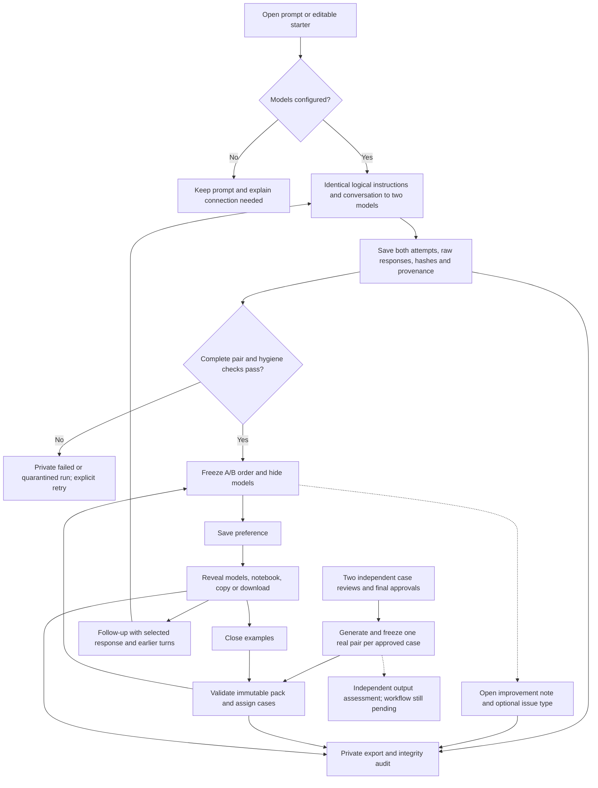

# Data pipeline — 9 September 2026

Implemented locally; direct API smoke tests, validated real packs and hosted release remain pending. See [sprint status](TWO-DAY-SPRINT.md).



## Three explicit entry paths

1. **Open prompt or editable starter:** neutral accounting instructions, exact user text and any supplied history go to two configured models. A starter supplies editable text only. Source ID/version and whether it was edited are stored; it never routes silently to an authored answer.
2. **Close examples:** the server assigns approved immutable case packs to the same participant. It serves the same frozen real outputs to every assigned reviewer, persisting each person's A/B order and vote. Reopening resumes the same run. There is no approved real pack in the participant database yet.
3. **Practice examples:** explicit authored fixtures remain below a disclosure. Their origin stays `authored-fixture`; they never count as model outputs or model-performance evidence.

## Follow-up behavior

After a vote, a blank composer continues from the selected revealed response. Each new request contains earlier user/selected-assistant turns plus the new instruction. Both models receive identical logical context; this is revision of a common artifact. Source/root run IDs, selected position, source artifact hash, turn number and exact history are stored. The new comparison is exploratory even if its parent was a shared case. Changing result tabs changes the selected response context. New question starts fresh. Context limits return an explicit error rather than silently discarding older messages.

## Inference and failure records

`pilot_inference.py` chooses the configured backend without automatic fallback:

- `direct`: `pilot_direct.py` maps common instructions/history to OpenAI Responses and Anthropic Messages. Requires `OPENAI_API_KEY`, `ANTHROPIC_API_KEY`, `OPENAI_MODEL`, `ANTHROPIC_MODEL`, and an invitation code. OpenAI requests use `store: false`; this does not imply zero retention. Provider default sampling and bounded output-token settings are recorded, not claimed equivalent.
- `openrouter`: two explicit OpenRouter model IDs, with routing/configuration preserved.
- `local-cli`: `pilot_local.py` invokes the owner's signed-in CLIs through the loopback-only boundary. CLI harnesses differ; these results are integration QA, not controlled API comparisons.

Every attempted call records exact request, request hash, requested/resolved model where available, timestamps, finish/status, response/request IDs, raw response, output hash, usage and cost where supplied. Missing metadata remains null. Authentication headers/environment values are not included. If one call fails, both attempt records are retained privately and no incomplete pair is displayed. Explicit retries link to the failed run; no synthetic replacement answer is used.

`pilot_audit.py` quarantines outputs with detected unexpected email, configured private host identifier, preparer sign-off or model self-identification. Original text is retained verbatim. These are limited heuristics, not proof that all sensitive content or incorrect statements have been detected.

## Storage and analysis boundaries

| Table / record | Purpose |
|---|---|
| `pilot_participants` | Same-browser token identity, invitation source, optional profile and separate permissions; token stored hashed |
| `pilot_runs` | Prompt/context, scope, frozen drafts and order, attempts/provenance, vote, lineage and assignment reference |
| `pilot_events` | Append-only improvement, reveal exposure, copy/download, case resume and private operator metadata events |
| `pilot_close_packs` | Immutable approved case/evidence/rubric and frozen real pair with pack hash |
| `pilot_case_assignments` | Stable participant/case mapping, ordinal, run and recorded prior exposure |

`/founder/export` requires the private admin token and returns `pilot-export-v2`, including private packs and attempts. Raw provider payloads do not appear in public run responses. No records are automatically published. New guests default to no research consent; publication and training permissions remain separate. Analyst eligibility also requires a cohort dataset label, qualified/verified reviewers and proper exposure handling; browser identity alone does not verify an accountant.

Preference means a reviewer chose that answer. Optional issue reports are observations, not adjudicated correctness. No report does not mean no error. Readiness/confidence remain unmeasured in quick votes. Correctness claims additionally need criterion-level independent assessments of the actual frozen outputs; that importer/workflow is still pending. Shared-case votes are repeated judgments of a small fixed output pool, not independent generations.

## Operator connection points

Run these from `backend/` with the intended private database URL already in the environment. Files containing actual reviews, identities, questions and raw outputs stay outside Git.

```sh
python -m pipeline.import_close_pack /private/path/approved-pack.json
python -m pipeline.pilot_roster PARTICIPANT_ID --alias friend-01 --preset-requested-at 2026-09-10T10:00:00-07:00
python -m pipeline.pilot_roster PARTICIPANT_ID --assignment-id ASSIGNMENT_ID --exposure validator
python -m pipeline.audit_pilot /private/path/pilot-export.json
```

The importer verifies brief/evidence/rubric hashes, two recorded independent approvals, generation after approval, identical approved brief/instructions across the pair, exact output hashes and real-output provenance. It cannot verify a human's identity or the truth of a claimed approval; the operator must check the private review references. Same pack ID plus changed content is rejected. No automatic approval generation exists.

The audit checks joins, ownership, request/output hashes and pair integrity, and reports scope counts without printing private prompts. Research counts are provisional eligibility filters, not publication approval. The three [draft case briefs](validation/CASE-BRIEFS-DRAFT.md) are ready for human intake. Operator generation/freezing, expert-assessment import, shared spend/concurrency controls and hosted preflight remain in the sprint backlog.
