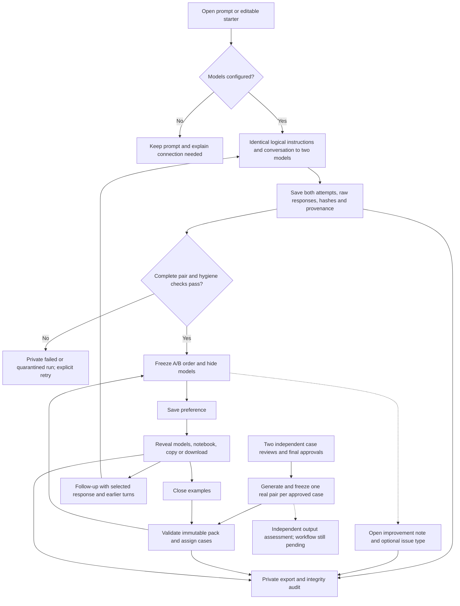

# The first 20 accountants

Current sprint scope, 8 September: [Ten accountants, open prompts and shared cases](TWO-DAY-SPRINT.md). The same ten friends use open prompting freely and then complete 3–6 preset comparisons in the same product. This supersedes earlier recruitment sequencing and targets three validated shared cases for the two-day release; six are stretch scope. The sprint file records current implementation and outstanding release work.

Updated, 8 September 2026. Keep the Design Arena front door: an open prompt in the center of the screen, immediate engagement, and optional examples. Reuse the existing Calibrated engraving/lens, dial and typography. This is an experiment in repeat participation, not a model benchmark launch.

## How the data flows

This is the everyday product flow. An independent conclusion is optional in older sample sessions, rather than a gate in new comparisons. The independent work needed to validate benchmark cases happens separately **before generation**: see [Case validation](CASE-VALIDATION.md).

The composer calls `/api/pilot/runs` with neutral accounting instructions. Editable starters come from `pilot_examples.py` and generate fresh exploratory outputs. `pilot_inference.py` selects direct OpenAI/Anthropic APIs, OpenRouter, or the local CLI bridge. Both models receive identical logical instructions and context; provider-specific settings and response metadata remain separately recorded. API adapters are mock-tested; keys and live hosted checks are pending.

`pilot_study.py` stores immutable approved packs and participant assignments. `/assignments/{id}/start` resumes the same frozen pair without generation or reshuffling. No approved real-output pack is loaded yet. Explicit authored practice exercises remain separate and never stand in for a user's prompt. For an imported pack, all evidence needed by models and voters must be in the approved brief.

SQLite stores participants, runs, events, case packs and assignments. Export v2 joins them with private inference attempts. Raw requests/responses are not returned by the ordinary participant API. Notebook persistence is operational; research/publication permission remains separate. No automatic correctness finding or public leaderboard is produced. See [current pipeline](DATA-PIPELINE.md) for exact connection points and operator commands.

## Simplification, 8 September

The response pair is the main screen: neutral paper, readable Markdown/tables, rounded panels and a nearby preference bar. Remove the large “Your question / Your call” headline, green fact box, required readiness ratings, reason checklist and confidence question.

One required action: **Prefer A / Prefer B**, with smaller **About the same / Neither** alternatives. Neither means neither is preferred; it is not a verified correctness or approval finding. The `preference-v2` record leaves readiness and confidence null. Earlier `approval-and-pair-v1` records remain intact and must be analyzed separately.

The initial per-response issue UI (superseded by the unified feedback box below) used: calculation, timing, account treatment, policy/framework, missing facts, unsupported claim, or other, plus an optional correction (required for Other). Reports are unverified observations, not automatic error scores. No flag does not mean correct. Reports are append-only events, joined by run ID and answer artifact/hash; reports made after author reveal are marked explicitly.

The first pair remains a single-turn comparison. After voting, the blank follow-up composer continues from the currently selected revealed response and all earlier turns. Both models receive that same context; we are not measuring two independently evolving conversations. A fresh question clears context. Historical edited-prompt revisions retain their original scope. Follow-ups and repeated/exposed case votes remain separately identifiable in export.

### Conversation and reveal refinement

Prompts sit in a right-aligned chat bubble; the response pair and model reveal sit on the left. After voting, open the preferred answer in a tabbed result with its model name prominent. Preserve ties and neither without inventing a first-place model. Authored samples remain labeled as authored. Copy exports the response text; Markdown download includes the prompt, response, author, source and creation date, without participant details or feedback. These are local export actions, not uploads to Drive.

Replace separate product-feedback and issue forms with one visible **What should improve?** box above the prompt composer. Text is required when saving feedback; issue type is optional. Feedback does not gate voting, export or another prompt. Before reveal, feedback targets the pair; after reveal, it targets the selected response tab. Preserve unsaved text per target when switching tabs. Existing issue records remain readable. New `response-improvement-v2` events include the target answer hashes and reveal exposure; uncategorized feedback is not automatically a correctness complaint.

Remove the “Keep working” heading. Keep the prompt composer and New question link. The blank follow-up composer now sends earlier turns and the selected response, as described above. New question starts without that context.

### Fixed model pair

Recommendation, checked 8 September: `openai/gpt-6-astra` and `anthropic/claude-opus-5`. They offer a useful cross-provider comparison on professional reasoning. This is a study-design choice, not a claim that either is best at accounting. See [OpenAI model documentation](https://developers.openai.com/api/docs/models/gpt-6-astra), [Astra on OpenRouter](https://openrouter.ai/openai/gpt-6-astra) and [Opus 5 on OpenRouter](https://openrouter.ai/anthropic/claude-opus-5).

Keep the pair fixed for a collection wave; save exact requested/resolved model IDs, date, instructions, parameters, provider response IDs and full output. Before collecting research data, verify both selected endpoints and compatible generation settings with the actual account and retention requirements. The current OpenRouter path still needs that credentialed preflight; the recommendation does not silently switch the configured local models. Fable 5.1 is also interesting, but its OpenRouter page currently explicitly says zero data retention is unavailable, which conflicts with this application's current routing requirement.

## From twenty accountants to defensible findings

Start with six independently validated cases, two models, and three comparisons per person: 60 pair judgments, balanced to roughly ten reviewers per case. Generate and freeze a shared pair per case before reviewers arrive. These are 12 model outputs rated repeatedly, not 60 independent model trials. Recruit validators separately where practical; exclude their own cases from the preference sample.

Report preference counts by case (A/B/tie/neither), expert-assessed material errors by criterion, and usability observations (completion, voluntary refinement, return visits, optional usefulness feedback and interviews). Time between showing drafts and voting includes idle time; it is not active reading time. Optional issue reports can discover defects but cannot supply an unbiased error rate.

Open prompts supply task discovery and exploratory preferences. They stay in a separate analysis from the controlled shared cases. With this small convenience sample, publish a bounded field note with denominators, disagreements and limitations, not a universal leaderboard. Shared real-output case distribution, expert adjudication and preference estimation remain research work to implement; today's samples are authored fixtures. Obtain publication permission before publishing participant content.

## What I compared

- GitHub main `d478e45`: strongest brand (paper, spruce, editorial documents, dial), but Ask discards the prompt; five-round forced-choice bracket; fictional model/season statistics and unverified credential language. Too many product promises before the first useful result.
- Research branch `56f54d6`, Demo A: four drafts, per-draft approval, ranking with ties. Good measurement ambition, excessive reading/ranking burden for an unpaid first visit. Static demo; stores nothing.
- Same branch, Demo B: a familiar review queue with approve/note/reject, occasional duel, correction and confidence. Better professional language. Four heterogeneous items make first-session value slow; demo calibration and signable percentages are not earned evidence.
- Earlier local Ask/Challenges implementation: useful separation and paired OpenRouter contract; still lacks a complete cohort identity/observation system. Do not substitute its older checkout for latest main.

## Earlier mechanism assessment (superseded)

The earlier prototype required per-draft approval, preference, reasons, confidence and an independent conclusion for samples. The 8 September decision above replaces that participant workflow with one preference and optional issue reports. The two-draft limit is a product bet about effort, not a claim that pairwise beats all other formats.

| Mechanism | Measures / contribution | Immediate value | Invalidity risk | First cohort |
|---|---|---|---|---|
| Two drafts + approval rubric | Mixed: policy/amount checks separate from preference; accountant identifies defects and preferable presentation | Compare approaches, inspect explanation, retain own answer | Style, position, ambiguous policy, fixture authorship | Yes; short journal-entry and period-end cases |
| Four-way ranking | Relative preference among four static artifacts | Broader model comparison | Burden, ties confusion, dependence among derived pairs | Defer |
| Single-output review + correction | Approval readiness and failure reasons; no pairwise estimate | Familiar workpaper review | Leniency varies by reviewer; no matched alternative | Borrow the language; test alone if pairs feel burdensome |
| Free question / Ask | Exploratory preference under same prompt/config settings | Useful responses to their own question | No common task population or known ground truth | Yes; separate exploratory pool, live provider required for real utility |
| Reconciliation sandbox / recorded agent run | Stateful correctness, investigation, controls and consistency | Review a real workflow | Incomplete traces, unjustified inference from final prose | Defer until static review earns repeat use |

Static pages are enough when all necessary facts and the final artifact fit on screen. Use an environment when the task requires investigating sources or changing the books. A chat box cannot validate a reconciliation agent.

## Features and experiment hypotheses

1. Prompt-first entrance, work-type choices and explicit samples, and a single preference: accountants can engage immediately. Guests can start without a consent checkbox or background questionnaire. Operational storage is disclosed through Data use; private research reuse is a separate optional profile opt-in. Measure entry -> drafts -> judgment; for older cases, preserve whether the independent-conclusion step was completed or skipped. Collect optional professional context after the reveal, preserving the same participant and judgments.
2. Ask: useful questions lead to voluntary returns. Measure live own-question sessions separately from authored cases, including usefulness and later-day activity. Arbitrary prompts have no fixture fallback: without live credentials the prompt stays in the composer with a configuration message.
3. Optional post-reveal background profile + browser-bound saved work: role/experience/context help interpret disagreement and support return behavior. Self-reported, never credential verified. Measure completed cases, later-day visits and profile completion; background-missing guests must not be counted as qualified accountants. Browser identity is not proof of a unique human.
4. Separate correctness and preference: a preferred response can still be wrong. Inspect optional issue reports and expert assessments; do not manufacture readiness or confidence from quick votes.
5. Reveal and case-only share link: learning is the reward and a case is the invitation. Measure share intent and referred starts, not imaginary reach. No personal results or prompts go into share links.
6. Founder review/export: inspect every failed step and substantive contribution before scaling. Real participant events stay separate from authored fixture content and legacy seeds.

## Research interpretation

The repository methodology usefully separates objective correctness, professional criteria and preference, and warns about repeated reviewers/tasks, artificial seeds and fixed credential weights. Its future study sizes, thresholds and cost estimates are proposals, not validated launch requirements. We are intentionally cutting the proposed 25–30-minute, seven-screen pilot to one case with an optional next case.

Primary sources checked for this decision: [Chatbot Arena](https://proceedings.mlr.press/v235/chiang24b.html) establishes a human-preference mechanism, not accounting correctness. [Preference with ties](https://arxiv.org/abs/2410.05328) supports retaining ties; it does not settle this cohort's best UX. [OpenRouter ZDR](https://openrouter.ai/docs/guides/features/zdr) documents eligible routing, not an exemption from our own storage responsibilities. Other research in the repository remains supplied background; numerical claims are not re-certified here.

## Scope boundaries

No public leaderboard, CPA badge, peer percentile, paid assignment promises, enterprise console, agent execution, uploads, referral rewards, or social feed. No credential multipliers. No reuse of questions or corrections for training/publication without a later separate opt-in. Enterprise workflow evaluation remains the commercial hypothesis; this pilot sells accountants a useful practice session.

## What we could publish

First: a transparent field note on what 10–20 self-reported accounting professionals found difficult to review, with case-specific denominators, rubric disagreements and consent-cleared corrections. Authored fixtures can establish usability and defect-detection observations, never model performance. To publish actual model preference, collect and freeze real outputs with model/config/prompt/version provenance, independently validate the cases, and obtain appropriate publication consent.

For legacy full-review records, report A/B/tie/neither/insufficient separately and show per-output approval rates and stratify by case and reviewer context. Do not flatten repeated votes into independent observations or treat confidence as expertise. Use paired reviewer-by-case records; deduplicate first judgments for primary estimates, label repeats. Once enough cases/reviewers exist, estimate uncertainty resampling reviewers and cases, with ties modeled explicitly. At 20 people, show counts and uncertainty/limitations; do not manufacture a universal rank.

## Workspace and entry routing

Calibrated is the brand; Accounting is the current workspace. Persistent left navigation holds New comparison, Sample cases, Notebook and How it works. Journal entry, Treatment memo and Workpaper review select the requested artifact, not a canned answer. Samples are explicit instances within those types: selecting one loads its full brief, and editing it switches to live generation. See [Data pipeline](DATA-PIPELINE.md).

## User-facing positioning

User direction, 6 September: remove founding-cohort, pilot and beta framing throughout the participant experience, including profile, notebook, help and errors. Present Calibrated as the product. Keep factual source labels for authored samples and actual connection errors; do not imply model generation or verified credentials. Internal cohort operations, validation status and dataset labels remain in private documentation and records.
