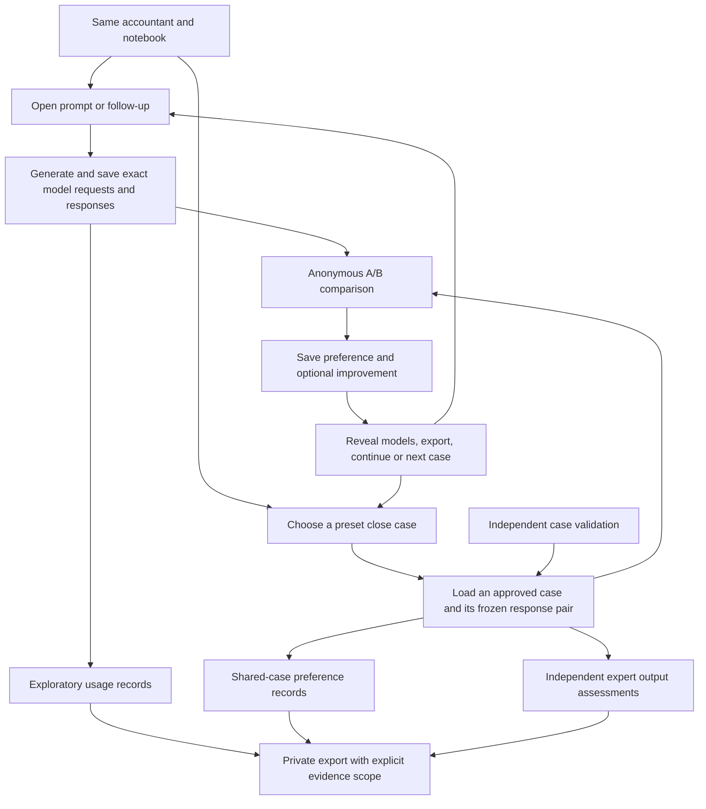

# Two-day sprint: ten accountants, open prompts and shared cases

Created 8 September 2026. Target: distribution-ready on 10 September 2026, subject to credentials, hosting and accountant availability. CA2D IDs are repo planning references; canonical Linear links are in [LINEAR-SYNC.md](LINEAR-SYNC.md). The original target date is historical.

## Linear synchronization — 15 September 2026

[Project](https://linear.app/dmu/project/calibration-arena-mvp-b9ae1eea6100) · [Sprint document](https://linear.app/dmu/document/ten-accountant-release-sprint-open-prompts-and-validated-close-8ebb4a015288)

Reviewed all 47 pre-existing project issues, including completed/backlog work, and searched the workspace for CA2D tickets before creating any. Reused existing issues where scope overlaps; six new issues cover missing work. CA2D-03 and CA2D-07 share one canonical issue. COR-355's obsolete no-match routing scope is canceled; prompt capture belongs to COR-351/COR-372. Completed prototype tickets remain unchanged.

| Sprint ticket | Canonical Linear issue(s) |
|---|---|
| CA2D-10 | [COR-352](https://linear.app/dmu/issue/COR-352), [COR-357](https://linear.app/dmu/issue/COR-357), [COR-346](https://linear.app/dmu/issue/COR-346) |
| CA2D-11 | [COR-359](https://linear.app/dmu/issue/COR-359) |
| CA2D-12 | [COR-374](https://linear.app/dmu/issue/COR-374) |
| CA2D-01 | [COR-351](https://linear.app/dmu/issue/COR-351) |
| CA2D-02 | [COR-369](https://linear.app/dmu/issue/COR-369) |
| CA2D-03 | [COR-370](https://linear.app/dmu/issue/COR-370) |
| CA2D-04 | [COR-356](https://linear.app/dmu/issue/COR-356) |
| CA2D-05 | [COR-353](https://linear.app/dmu/issue/COR-353), [COR-360](https://linear.app/dmu/issue/COR-360) |
| CA2D-06 | [COR-371](https://linear.app/dmu/issue/COR-371) |
| CA2D-07 | [COR-370](https://linear.app/dmu/issue/COR-370) |
| CA2D-08 | [COR-372](https://linear.app/dmu/issue/COR-372) |
| CA2D-09 | [COR-373](https://linear.app/dmu/issue/COR-373) |

COR-354 coordinates the same ten friends; COR-362 owns subsequent findings. Existing Clerk, trap-bank, public-board and expansion work stays later backlog. Project milestones now name direct APIs and validated close cases; Clerk/trap prerequisites were removed from the current release path. The existing project target of 18 September is unchanged; the original 10 September date below is historical, not a new promise.

Local implementation remains unpushed and undeployed in this worktree. The 9 September test results below are historical evidence and were not re-run during this documentation/Linear synchronization. Human case validation and live direct-provider checks remain pending. This is a point-in-time reconciliation, not an automatic bidirectional sync service.

## Execution status — 9 September 2026

Work is implemented locally on `codex/accountant-pilot`. As of that implementation pass, nothing had been created in Linear, pushed, or deployed. Linear was reconciled on 15 September; see the link map above. The acceptance criteria below remain the release checklist; partial implementation is not a completed release ticket.

| Ticket | Current state | Remaining |
|---|---|---|
| CA2D-01 | Implemented: neutral open prompt, editable starters, Close examples sidebar | Hosted verification |
| CA2D-02 | Implemented: selected response plus earlier conversation goes to both models; tested with actual local CLIs | Direct API smoke test after credentials |
| CA2D-03 | Implemented: stable assignments, same-browser identity, progress/resume, private roster/exposure command | Real approved pack; cross-device recovery remains out of scope |
| CA2D-04 | Implemented: exact requests, both attempts, raw provider responses, hashes, usage and hygiene quarantine; direct API contract tests pass | Live direct-provider checks; heuristic hygiene is not certification |
| CA2D-05 | Three [draft briefs](validation/CASE-BRIEFS-DRAFT.md) prepared for independent review | Two human solutions, reconciled rubric, source verification and approvals |
| CA2D-06 | Immutable pack schema/import validation implemented | Operator generation/freeze command and actual approved real-output pack |
| CA2D-07 | Shared frozen-pair serving, ownership, A/B persistence and idempotent resume implemented | Real pack activation after approval/generation |
| CA2D-08 | Export v2, copy/download events, context linkage and private audit command implemented | Full release trajectory and analysis procedures; no population estimates yet |
| CA2D-09 | Blank independent assessment forms available | Expert-assessment importer, human output assessments and adjudication |
| CA2D-10 | Direct OpenAI/Anthropic adapters implemented, server-only placeholders prepared | Keys, explicit model IDs, spending/concurrency ceiling, hosting and durable storage |
| CA2D-11 | Backend tests and frontend build pass; isolated browser journey checked | Hosted and mobile release checks after remaining work |
| CA2D-12 | Not started | Three additional cases after the first three |

Verified: **55 backend tests passed**, frontend production build passed. Browser QA used a separate temporary database containing explicitly synthetic approvals/outputs: case vote → reveal → improvement → actual local-CLI follow-up → copy → return to cases → same completed case resumes, with progress at 1/3. Synthetic test packs are not in the participant database and are not evidence of accountant validation or model quality. Direct API behavior has been checked with mocked contracts, not paid provider calls.

The first three shared cases are intentionally unavailable in the participant app until validated real packs exist. The landing-page starters are editable prompts that request fresh model outputs, not substitutes for these controlled comparisons. Two independent accountants are still needed. No case or answer key has been certified by software tests.

## Provider and reviewer clarification — 8 September

Recommended hosted path: **direct OpenAI and Anthropic APIs**, one fixed model from each provider. OpenRouter is optional, not a release prerequisite. References below to OpenRouter credentials/preflight should be read as hosted-provider credentials/preflight; the implementation now supports `direct`, `openrouter`, and `local-cli`. The owner’s local environment remains on local CLI until credentials and model IDs are supplied.

Use the small configurable provider interface demonstrated by Corsac's `get_llm_client()` / `factory.py`, verified on GitHub, without importing its orchestrator/worker pipeline or automatic model fallback. A comparison makes two model calls, with the same logical instructions and context mapped to each API's supported request format. Freeze actual settings and model IDs; never silently substitute a different model when a call fails. Budget an additional **2–3 engineering hours** for direct adapters and mocked request/response contract tests, making the sprint approximately **20–25 focused hours** before external delays.

Required secret names for that implementation are `OPENAI_API_KEY` and `ANTHROPIC_API_KEY`, plus two explicit model IDs and an application spending ceiling. These are implemented direct-provider settings; the direct mode is not yet enabled or live-tested. Store them server-side. Verify provider-specific retention/storage behavior and update data-use copy; OpenRouter's routing flags do not apply to direct API calls and must not become an unsupported zero-retention promise.

The personal local CLI bridge is not the shared release backend. [Anthropic's current credential guidance](https://code.claude.com/docs/en/legal-and-compliance) excludes routing users' requests through personal Free/Pro/Max credentials and directs product developers to API authentication. [OpenAI's authentication guidance](https://learn.chatgpt.com/docs/auth) distinguishes subscription from API access and recommends API-key authentication for programmatic CLI workflows. Direct APIs avoid installing and maintaining either coding CLI on the hosted app.

David is finding two accountant friends and potentially a third. Keep the first two independent; use the third for a blind consistency check before showing the earlier assessments, followed by adjudication where needed. Preserve that third review as evidence, not a discarded trial. Reviewer identities/availability are still pending. If the third has prior case or rubric exposure, record it alongside the other reviewers' exposure.

## Outcome and scope

Ten accountant friends use one product and keep the same notebook and participant identity throughout. They can ask their own questions and continue working for as long as they find it useful. David then asks those same people to complete 3–6 preset comparisons. No separate five-person discovery wave and no requirement to hire a second group.

Ship three validated presets as the two-day minimum; add three more if validation finishes in time. All six appear in the planning backlog, but unfinished cases do not appear as available comparisons. Keep open prompting available before, during and after preset work. Separate the records for analysis, not the people or the interface.

The product remains Calibrated, with Accounting as its workspace. No founding-cohort or beta labels. Preserve the prompt-first page, left navigation, chat alignment, one-click preference, model reveal, export, and open improvement field. Do not add a mandatory expert checklist to ordinary voting.

### Participant journey

1. Open the invitation link, enter the invitation code once, and ask an accounting question. No required format/category choice or background survey before the first response.
2. Compare two responses, vote, reveal the models, copy/download a useful answer, and optionally explain what should improve.
3. Continue prompting. The interface must accurately distinguish a follow-up with context from a fresh question.
4. When ready, use the persistent **Close examples** sidebar link, or David's link to that page. See three assigned cases with progress and resume support. Up to three additional cases may be offered after the first three.
5. Vote and optionally comment on each example using the same interaction. Return to open prompting at any point.

The original invitation and a later request to complete cases are separate touchpoints within this same journey. Record reminder timing so prompted case visits are not described as spontaneous retention.

## Validation kickoff: original audit (before this implementation)

Historical baseline: collection-gap audit completed; expert validation NOT started. Current engineering status is in the execution table above. No case, answer key or output has been newly certified by this sprint plan. The audit below is source inspection, not a new runtime or deployment test.

| Area | Inspected state | Gap / ticket |
|---|---|---|
| Open questions | `pilot_tasks.py` and `Start.task_type` require one of three formats; default is journal entry | General question mode, without silently forcing an entry — CA2D-01 |
| Continuation | Composer sends an edited prompt and source run ID; previous responses are not sent | Real, explicitly scoped follow-up context — CA2D-02 |
| Participant linkage | Browser token, notebook, source labels and optional profile already exist | Link case assignments and prior exposure to that identity — CA2D-03 |
| Presets | `start()` snapshots `CASES` as authored fixtures | Frozen real-output pack and distribution — CA2D-06/07 |
| Generation provenance | Model IDs, settings, timestamps and request hashes exist | Complete request payload, provider response ID, finish status, attempt/failure and usage records missing from current OpenRouter artifact — CA2D-04 |
| Expert review | `CASE-VALIDATION.md` and blank independent-review template exist | Approved briefs/rubrics, actual independent submissions, import and adjudication records — CA2D-05/09 |
| Preference | Quick preference is immutable; output-specific improvement events record reveal exposure | Explicit pack, case, artifact and exposure joins; complete export validation — CA2D-07/08 |
| Hosted access | Local CLI is loopback-only; hosted OpenRouter configuration is documented | Actual credentials, public HTTPS host, durable storage and live preflight — CA2D-10 |
| Usage limits | Current start endpoint stops at 20 sessions per participant/day | Configurable invited-user limits and a shared spend/concurrency ceiling — CA2D-10 |
| Output hygiene | Earlier synthetic run showed account identity in local Claude output | Regression check before any content is distributed; no public tunnel to the personal CLI bridge — CA2D-04/11 |

Source references: [router](../../backend/app/routers/pilot.py), [inference](../../backend/app/pilot_inference.py), [UI](../../frontend/src/pilot/Pilot.tsx), and [validation procedure](CASE-VALIDATION.md). File paths in ticket descriptions are relative to the repository root.

### Case intake register

These are candidate tasks, not validated briefs or answer keys. Use synthetic companies and a single explicitly stated framework, initially US GAAP. Each case must contain enough ledger state and support to judge the requested action. All reviewer slots and approvals are currently **unassigned/pending**.

| ID | Candidate | Main question for validation | Scope | Status |
|---|---|---|---|---|
| CLOSE-01 | An accrual recorded twice | Can the response identify the existing posting, avoid double counting, and explain the correction and later clearing? | Required | Draft brief prepared; human rubric pending |
| CLOSE-02 | An invoice received after close | Does the response use the service/receipt evidence and period correctly, including whether an entry is needed? | Required | Draft brief prepared; human rubric pending |
| CLOSE-03 | A payment that does not match | Does the response distinguish supported reconciliation from an unsupported adjustment, and request the evidence needed? | Required | Draft brief prepared; human rubric pending |
| CLOSE-04 | Two plausible invoice matches | Does the response avoid confidently clearing the wrong item and specify how to resolve ambiguity? | Stretch | Not started |
| CLOSE-05 | A customer contract changed mid-period | Does the response identify the relevant facts and an acceptable revenue-treatment conclusion? | Stretch | Not started |
| CLOSE-06 | A workpaper with missing support | Does the response distinguish a supported calculation from an unsupported assumption and give actionable review notes? | Stretch | Not started |

For every case, preserve: brief version/hash, evidence packet/hash, framework/period, requested deliverable, two original independent solutions, criterion IDs and acceptable alternatives, evidence references, material-error definitions, reconciliation record, final approvals, frozen pair IDs, two assessments per output, and adjudication status. Completed human forms stay in private storage; only blank forms and synthetic approved content may enter Git.

## Schedule and dependencies

Engineering estimates total approximately **18–22 focused hours**, excluding provider/hosting troubleshooting, human review, and the three stretch cases. This is an aggressive two-calendar-day target, not a delivery guarantee. It assumes reuse of this implementation and prompt access to credentials and validators. Do not remove capture or review gates to meet the date.

| Window | Engineering | David / accountant dependencies |
|---|---|---|
| Day 1 morning | CA2D-01; start CA2D-04 and CA2D-10 preflight | David supplies hosting/provider access and budget; identifies two experienced friends; CA2D-05 drafts handed to them |
| Day 1 afternoon | CA2D-02/03; CA2D-06 pack loader against clearly marked test data | Independent case solutions, reconciliation and approval of the first three cases |
| Day 2 morning | Generate/freeze approved pair pack; CA2D-07/08; CA2D-09 import | Both experts assess anonymous frozen outputs; resolve material disagreements |
| Day 2 afternoon | CA2D-10 hosted checks and CA2D-11 end-to-end verification; fix release blockers | David confirms distribution; friends receive the same app plus later preset request |
| Only after required work passes | CA2D-12 additional cases | Same validation and assessment requirements for each extra case |

Critical path: provider preflight + case approval → generation/freeze → pack distribution → capture/export verification → hosted release. Output assessment is required before correctness findings can be reported; it can finish after preference collection begins, without changing the frozen outputs. Target completing it for the first three cases by release, but do not claim it is complete if it is pending.

Needed from David: `OPENAI_API_KEY` and `ANTHROPIC_API_KEY`, two confirmed model IDs, host/project and domain access, an initial spend ceiling, and two qualified validators with relevant framework experience. Store secrets only in the deployment secret store; commit placeholder names, not values. Clerk is not a prerequisite for these ten invitees; same-browser guest identity and a private invitation roster are sufficient for this scope. Cross-device recovery remains a documented limitation.

Two validators may be among the ten friends. Record their case-authoring/rubric/output-review exposure. Everyone can use both flows, but report exposed votes separately from first-exposure preference. If two friends validate all cases, three cases produce up to 30 votes but only 24 from the eight unexposed friends; six produce up to 60 total and 48 unexposed votes. Do not describe these as independent model generations.

## Linear-ready tickets

Current statuses are in the execution table above. The following descriptions retain the complete acceptance criteria; implemented portions do not imply every release criterion has passed. Owners indicate responsibility, not an assignment sent to anyone. Priority P0 = required for the specified distribution; P1 = required for correctness reporting or an explicit stretch item.

### CA2D-01 — Simplify the prompt entry and introduce Close examples

Priority: P0 · Owner: Engineering · Estimate: 1h · Labels: product, frontend, backend · Depends on: none

Replace the mandatory Journal Entry / Treatment Memo / Workpaper Review buttons with one general accounting prompt. Add Close examples in the sidebar and a small set of concrete example links. Preserve the current visual system and model reveal.

Acceptance:
- A free question uses neutral, versioned accounting instructions shared by both models. Existing task IDs and historical records continue to work.
- Example selection displays its exact brief. Editing it removes fixed-case eligibility and generates a fresh exploratory pair with its source case recorded.
- No category guess modifies the prompt. Optional operator topic coding is separate metadata with coder/version recorded.
- No beta/cohort labels, required profile form, or new consent checkbox in the composer. Existing data-use and research-permission distinctions remain accurate.

Files: `frontend/src/pilot/Pilot.tsx`, `api.ts`, `backend/app/pilot_tasks.py`, `routers/pilot.py`, methodology copy.

### CA2D-02 — Make follow-up prompting genuinely contextual

Priority: P0 · Owner: Engineering · Estimate: 2–3h · Labels: conversation, backend, frontend · Depends on: CA2D-01/04 contract

The earlier composer regenerated an edited standalone prompt; the local implementation now includes prior context. Implement explicit refinement of the selected revealed answer, preserving the conversation in the UI. Send both models identical context: the prior question, selected answer text and new instruction. This is refinement of a common artifact, not two independently evolving model conversations.

Acceptance:
- “Explain the second entry” resolves against the selected response without retyping it; the selected model/answer is clear next to the composer.
- Store parent/root IDs, source artifact/hash, full sent context, turn number and `evaluation_scope=exploratory-followup`. No hidden context from another session.
- New question starts a clean context. A preset follow-up never changes the frozen original or its vote.
- Context limits are explicit; no silent truncation. Follow-up votes stay out of primary first-turn model comparisons.
- Verify the actual serialized requests, not just the chat appearance.

### CA2D-03 — Keep one participant journey with resumable case assignments

Priority: P0 · Owner: Engineering · Estimate: 1–1.5h · Labels: identity, research · Depends on: CA2D-01

Reuse browser guest identity and notebook. Assign the first three cases to each friend, vary their order with a reproducible assignment record, and offer the next three only when ready. Link David's private invitation alias to the participant without putting personal information in URLs.

Acceptance:
- Open prompts and preset work join to one participant; sidebar shows completed/remaining assigned cases and resumes after refresh.
- Record invitation source, case assignment, exposure status, and the date David asked for preset completion.
- No forced transition, timer, three-case gate on open prompting, or account creation requirement.
- Browser reset/cross-device duplicates can be identified and annotated privately; no claim that a browser token proves a unique accountant.

### CA2D-04 — Store auditable inference records and verify output hygiene

Priority: P0 · Owner: Engineering · Estimate: 2h · Labels: inference, data-quality · Depends on: provider configuration for live verification

Extend current provenance into an exact private request/output record. Request hashes alone cannot reconstruct what was sent. Preserve generation attempts rather than dropping the successful half when its partner fails.

Acceptance:
- Store exact messages, requested/resolved model IDs, available provider routing/response IDs, parameters, prompt version, start/end timestamps, finish reason, usage/cost when supplied, original output bytes/text and hashes. Mark unavailable fields null; never invent provider metadata.
- Failures, retries and rejected/truncated generations have attempt IDs and reasons. Both responses must succeed before a pair is reviewable.
- Record actual routing restrictions and tool availability. No API keys, authorization headers, or host environment dumps enter provenance.
- Regression-check host name/email and author self-identification using synthetic test identities. Quarantine affected preset outputs and retain their rejection record; do not silently edit answers into a publishable result.
- Check current credentialed hosted responses for completion and identity leakage before release. Personal local CLI mode stays local.

### CA2D-05 — Draft and independently validate the first three case packs

Priority: P0 · Owners: Engineering/content preparation; David coordinates two accountant friends · Estimate: 1.5–2h preparation, plus roughly 4–6 total accountant-hours subject to complexity · Depends on: reviewer availability

Prepare CLOSE-01/02/03 using the intake register and existing independent-review template. Give each validator the same facts and supporting material without a proposed answer, model output, or the other person's solution.

Acceptance:
- Each case has explicit framework, period, relevant ledger state and supporting evidence; no hidden facts needed to pass.
- Preserve six independent solutions for three cases, reviewer qualification/conflicts and timestamps. Reconcile disagreement in an appended record, not by overwriting originals.
- Approved rubric specifies criterion IDs, accepted alternatives, missing-fact responses, sources and material-error definitions. Ambiguous cases are revised and reviewed again or excluded.
- Exactly approved versions are eligible for production generation. AI-authored draft rubrics never count as independent validation.
- If reviews are not available by day two, mark the validated-preset milestone blocked. Do not relabel authored fixtures or unvalidated cases to claim the sprint passed.

### CA2D-06 — Generate and freeze a versioned shared response pack

Priority: P0 · Owner: Engineering · Estimate: 1.5–2h · Labels: benchmark, backend · Depends on: CA2D-04/05

Add a small operator command and immutable pack manifest. Reuse provider adapters and existing storage rather than building a benchmark platform.

Acceptance:
- Input is an approved case/rubric version plus a pinned model/config pair. First three cases produce six real output artifacts and three pair IDs.
- Predetermine selection: first complete successful response per model under fixed settings; infrastructure retries are logged. Do not regenerate merely because an answer is poor.
- Manifest joins case, brief, evidence, rubric and request/output hashes; no secret or private reviewer identity in public payloads.
- Freeze is append-only. Changed facts, instructions, settings or answers create a new version and collection scope; votes never move to the replacement pack.
- Import rejects missing approvals, hash mismatches, duplicate IDs and authored fixture artifacts presented as model responses.

### CA2D-07 — Serve shared presets and preserve blind first judgments

Priority: P0 · Owner: Engineering · Estimate: 1–1.5h · Labels: frontend, backend, collection · Depends on: CA2D-03/06

Make Close examples load an assigned pair from the frozen pack, not invoke models again. Reuse the existing comparison, feedback and reveal components.

Acceptance:
- Different participants receive identical response texts for a case, with per-participant A/B assignment saved server-side. Refresh preserves the assignment.
- One immutable primary preference per participant/case/pack; duplicate submits are idempotent. Revisits show the original result and are recorded as repeat exposure.
- Anonymous API responses contain no model IDs, identifying metadata, hidden rubric or assessment findings before voting; expected findings appear only after the vote when available.
- Record prior validator/author exposure separately. New case versions and edited examples cannot accidentally count as first votes on the old pack.
- Completing three shows progress and allows additional available examples, open prompting or exit without a new form.

### CA2D-08 — Validate the end-to-end capture and export contract

Priority: P0 · Owner: Engineering · Estimate: 1.5h · Labels: analytics, research, data-quality · Depends on: CA2D-02/03/04/07

Extend the private export so the two parts of the same participant journey can be analyzed without mixing their evidence. Add only actionable events: response display, vote, improvement save, copy/download, follow-up and preset progress.

Acceptance:
- Every observation joins participant → run → scope → case/pack where applicable → displayed artifact mapping → preference/feedback. Missing required joins fail an audit command.
- Include exact submitted prompts and feedback privately; topic codes never replace them. No duplicate raw prompt content in analytics events.
- Store event IDs/timestamps, failure/latency records, feedback target and before/after-reveal status. Copy/download is an action, not proof of real-world use or correctness.
- Export original first-turn, follow-up, edited-preset, frozen-preset, fixture, synthetic/QA, repeated and expert-exposed records distinctly. Respect existing research permission and separate publication/training permissions; keep non-consenting operational data out of research summaries.
- Deterministic fixture audit covers two participants receiving one pack, repeat submit, refresh, preset edit, follow-up, failed generation and one expert assessment. No orphan records or changing output hashes.
- Document denominators: 10 × 3 = up to 30 votes on six outputs; 10 × 6 = up to 60 votes on twelve outputs. Exclude/stratify prior exposure, duplicates and missing permissions; report actual counts.

### CA2D-09 — Capture independent output assessments and adjudication

Priority: P1 for distribution; required before correctness reporting · Owners: Engineering + two accountant validators · Estimate: 1h importer/validation, plus roughly 2–4 accountant-hours for the first three pairs · Depends on: CA2D-05/06

Use private structured forms or CSV/JSON import, not a new expert dashboard. Both validators assess every anonymous frozen response against the already approved rubric, independently of each other and without preference totals.

Acceptance:
- First three cases require twelve independent output assessments: two experts × six outputs. Six cases require twenty-four.
- Each criterion records met / not met / not assessable / not applicable; failures record quotation/location, correction and materiality. Missing evidence is not a pass.
- Import verifies reviewer, case/rubric version and artifact hash, completeness and independence timestamps. Original assessments remain immutable; disagreements and adjudication are appended.
- Reports distinguish verified criterion findings, unresolved disagreements and participant-reported issues. No issue report is automatically an expert-confirmed defect; no missing report means correct.
- Pending assessments do not prevent a valid preference vote. They do prevent correctness claims. A scoring interpretation change preserves rubric version history and reassessment scope.

### CA2D-10 — Prepare an invited hosted release with durable storage

Priority: P0 · Owners: Engineering; David supplies access/budget and approves distribution · Estimate: 2–3h with an existing host, otherwise re-estimate · Labels: release, infrastructure · Depends on: CA2D-04; full release depends on CA2D-07/08

Use one HTTPS origin for frontend/API and durable database storage with a tested private backup. Configure real provider endpoints, invitation gating, a random admin secret and separate QA/participant datasets. Do not expose the personal Codex/Claude CLI bridge publicly.

Acceptance:
- Credentials are server-only. Both actual chosen endpoints pass an authenticated preflight under the configured routing policy; failures cannot produce a fake sample answer.
- Replace the hardcoded 20-session daily stop with configurable invited-user limits; add total-spend/concurrency bounds agreed with David. Allow continued use within that budget with a clear, recoverable limit state.
- Verify overlapping requests, timeout/retry handling and preservation of the prompt. No claim of unlimited inference.
- Hosted restart preserves notebook, votes, frozen packs and event records; backup/restore is verified on a separate test copy. Participant A cannot access B; admin export remains protected.
- Produce the exact release URL and setup/rollback instructions. Deployment/distribution is a final authorized action; this ticket file itself does not deploy or send invitations.

### CA2D-11 — Run release validation for the complete ten-friend journey

Priority: P0 · Owner: Engineering · Estimate: 2h · Labels: qa, release · Depends on: CA2D-01 through 08 and 10

Test the implemented behavior in a browser and against persisted records. Use separate QA identities, not invented accountant participation.

Acceptance:
- Desktop and narrow-screen flow: open prompt → pair → preference → model reveal → feedback/export → contextual follow-up → Close examples → three cases → resume notebook → new prompt.
- Two QA participants see identical preset output hashes with stable randomized display mapping; model identity is hidden until vote.
- Test reload/back navigation, duplicate vote, concurrent request, provider failure, quota, case edit, exposed reviewer, and storage restart. Verify each through export as well as UI.
- Appropriate backend tests, frontend build and collection-audit command pass. Inspect one complete exported trajectory manually against what the browser showed.
- Verify no host name/email or unexpected author clues in distributed response content; no secret/rubric leakage in browser network payloads.
- Release record states exactly which cases are validated, which outputs are assessed, known limitations, unresolved blockers and launch URL. If fewer than three approved presets work, do not mark the requested combined experience complete.

### CA2D-12 — Expand from three to six approved close examples

Priority: P1 stretch · Owners: Engineering + validators · Estimate: re-estimate after first three · Depends on: required tickets complete

Add CLOSE-04/05/06 only through the same independent validation, freeze and assessment process. The existing assignment page offers these as additional comparisons without changing completed assignments or scores. No new screen, sandbox, upload system or leaderboard is needed.

## Release and evidence boundaries

- **Distribution-ready:** hosted open prompting and continuation work; at least three independently validated presets serve frozen real outputs; one participant journey is preserved; capture/export and privacy boundaries pass; credentials/budget are configured.
- **Correctness-report-ready:** independent output assessments and adjudication are complete for the reported artifacts, with clear unresolved cases and permission to use the material. This may follow distribution.
- **Not claimed:** representative accountant preferences, overall model accuracy, proof of buyer demand, human retention inferred from synthetic sessions, or a comparison of base models when harnesses/configurations differ.
- **Deferred:** Clerk/cross-device recovery, spreadsheet execution, document uploads, live ERP integrations, public rankings, a validator dashboard, automated grading as ground truth, and the extra three cases if they threaten the deadline.

Before publishing findings, verify permission for the exact participant material and report counts by case, exposure and judgment scope. Ten friends provide a useful bounded study, not a universal leaderboard.

## Scope authority

This plan supersedes the earlier five-friend-first / separate-recruitment advice and the older two-wave recruitment section in RUNBOOK.md. It does not mark its tickets implemented. Existing live app changes, old authored samples and synthetic reports retain their actual provenance.
